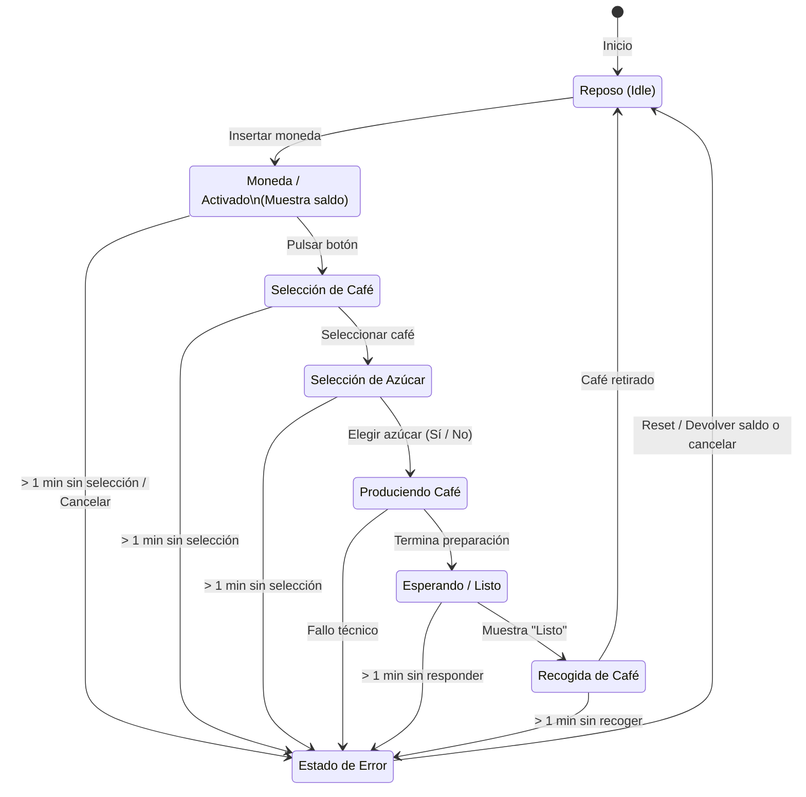

```mermaid
stateDiagram-v2
    [*] --> Idle: Inicio

    Idle: Reposo (Idle)
    Moneda: Moneda / Activado\n(Muestra saldo)
    SeleccionCafe: Selección de Café
    SeleccionAzucar: Selección de Azúcar
    Produciendo: Produciendo Café
    EsperandoListo: Esperando / Listo
    RecogidaCafe: Recogida de Café
    Error: Estado de Error

    %% Flujo principal
    Idle --> Moneda: Insertar moneda
    Moneda --> SeleccionCafe: Pulsar botón
    SeleccionCafe --> SeleccionAzucar: Seleccionar café
    SeleccionAzucar --> Produciendo: Elegir azúcar (Sí / No)
    Produciendo --> EsperandoListo: Termina preparación
    EsperandoListo --> RecogidaCafe: Muestra "Listo"
    RecogidaCafe --> Idle: Café retirado

    %% Transiciones por Timeout (> 1 min) o Fallo
    Moneda --> Error: > 1 min sin selección / Cancelar
    SeleccionCafe --> Error: > 1 min sin selección
    SeleccionAzucar --> Error: > 1 min sin selección
    Produciendo --> Error: Fallo técnico
    EsperandoListo --> Error: > 1 min sin responder
    RecogidaCafe --> Error: > 1 min sin recoger

    %% Retorno desde Error
    Error --> Idle: Reset / Devolver saldo o cancelar
```
